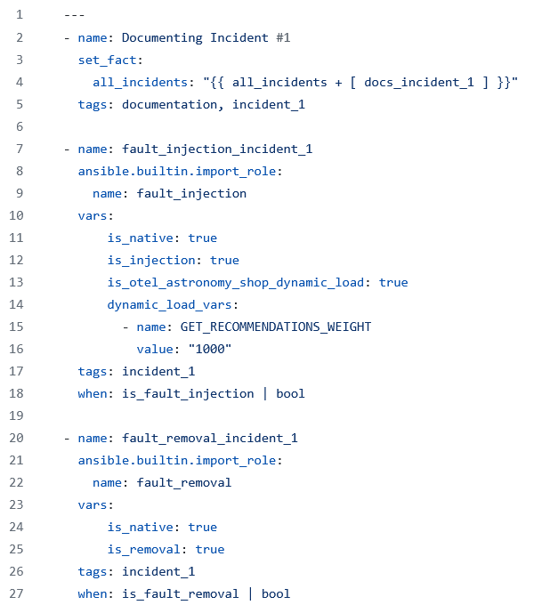

# Ansible for SRE Bench

Most high-level actions in SRE Bench management are run through Ansible.
In most cases, this will be activated using the [Makefile](../Makefile),
where you will find the command `ansible-playbook`.
If you find yourself debugging an ansible issue, you may want to change how that call is run.
Most commonly, [increasing the verbosity](https://docs.ansible.com/ansible/latest/cli/ansible-playbook.html#cmdoption-ansible-playbook-v)
will be your first step, giving more detail into what's happening in a playbook.
Either by editing the Makefile or by calling `ansible-playbook` explicitly from the command line,
you can add between one and six `-v` parameters.

# Ansible notes for creating incidents

A simple incident has at least these files in the `roles` directory:
* `incident_<n>`:
    * `tasks`
        * `main.yaml`
    * `vars`
        * `main.yaml`

An incident is typically loaded by the `base.yaml` in this block:
```yaml
  tasks:
    - name: Include incident role
      ansible.builtin.import_role:
        name: "incident_{{ incident_number }}"
```

The `import_role` first reads the `vars/main.yaml` file to populate the global namespace from variables listed there.
After that, the `tasks/main.yaml` is loaded.

## `vars/main.yaml` file

We're discussing this first because it's the simpler one.  It's just a list of variable names and values that are created when the role is loaded.
For example, on 20 February 2025, incident 1 started like this:
```yaml
---
scenario_domain: sre
sample_application: otel_astronomy_shop

is_install_chaos_mesh: false
fault_injected:
  - recommendationCacheFailure

docs_incident_1:
  "id": 1
  "name": "Recommendation Service Cache"
  "platform": "kubernetes"
```

The `---` at the top is an optional affectation that YAML uses to mark the top of a document.
Similarly, documents *should* end `___`, although we often forget to do that.
If you leave it out, I don't think anything breaks, but it's simple enough to do, so please just include it.

After that are a few global values as defined in [the CONTRIBUTING guide](CONTRIBUTING.md)
formatted in standard [YAML syntax](https://docs.ansible.com/ansible/latest/reference_appendices/YAMLSyntax.html).

The documentation block has a name that will be referenced in the `tasks/main.yaml` block described below.
Its contents must match the [incidents_schema.yaml](../roles/documentation/defaults/main/incidents_schema.yaml)
[JSON schema](https://json-schema.org/overview/what-is-jsonschema).  Note that JSON maps one-to-one with YAML
(pretty much), which is why a JSON schema can specify the contents of the documentation block in this YAML file.

## `tasks/main.yaml` file

This is the part of the incident definition that actually effects change to the running scenario.
By way of example, let's consider [incident_1]()

In the example of [incident_1](../roles/incident_1/tasks/main.yaml) The first block looks like this:



### Lines 2-5:
```yaml
- name: Documenting Incident #1
  set_fact:
    all_incidents: "{{ all_incidents + [ docs_incident_1 ] }}"
  tags: documentation, incident_1
```

The first line is a name.  This is printed to your console when the playbook is running, and serves to help you follow the trace.

The second line is the action.  In this case, [set_fact](https://docs.ansible.com/ansible/latest/collections/ansible/builtin/set_fact_module.html)
will modify a single global variable named `all_incidents`.  This variable is already known to exist, and is an array.
A new single-element array, containing the documentation block that was read from the `vars/main.yaml` when the role was loaded,
is added to the existing array.  This operation is carried out in a `{{`-bracketed section of a double-quoted string because
Ansible uses Jinja2 templating, and that's how it's done.  Please see [the official guidance](https://docs.ansible.com/ansible/latest/playbook_guide/playbooks_variables.html#using-variables)
if you are not already familiar with this syntax.

The final line of this section is the [tags list](https://docs.ansible.com/ansible/latest/playbook_guide/playbooks_tags.html).
You will have noticed by now that running a playbook spews a *huge* amount of text to your console, even from steps that do nothing (for example, because of a `when` clause).
Using tags cleans this up somewhat by completely ignoring blocks that are not tagged for one of the current running tags.
Because it's all YAML, there are numerous ways to write a list of strings, so the tags list may be formatted differently in some playbooks,
but it is :warning:important:warning: that you remember to include it, and spell the tags correctly.
Forgetting to include the tags when adding a new task is a common error.
<span title="When you make this mistake (and you will), remember that I told you so.">
If you leave the tags block off, the task will be ignored with no debugging output or acknowledgement.
</span>

### Lines 7-18:
```yaml
- name: fault_injection_incident_1
  ansible.builtin.import_role:
    name: fault_injection
  vars:
      is_native: true
      is_injection: true
      is_otel_astronomy_shop_dynamic_load: true
      dynamic_load_vars:
        - name: GET_RECOMMENDATIONS_WEIGHT
          value: "1000"
  tags: incident_1
  when: is_fault_injection | bool
```

As above, this task starts with a name.  Names are very important for tracing the progress of a playbook when running.
The command here is `import_role`.  It has been fully-qualified, which is not strictly necessary for common
[built-in modules](https://docs.ansible.com/ansible/latest/collections/ansible/builtin/index.html),
but it may help some people to keep track of custom vs. built-in modules, and it doesn't hurt.

The [import_role](https://docs.ansible.com/ansible/latest/collections/ansible/builtin/import_role_module.html) knows where our playbook `roles` directory is,
and in that it finds named folder (here, `fault_injection`), first loading the variables, and then exiting the tasks as described above.

The `vars` block for this task defines values that will be passed into the role processing.
These are different from [set_fact](https://docs.ansible.com/ansible/latest/collections/ansible/builtin/set_fact_module.html)
values in that they will not be visible after this operation completes, although that role could choose to
store them as facts by defining a task explicitly to do so.

As always, a `tags` block defines when this task will run, but here we also have a `when` specification.
A [when](https://docs.ansible.com/ansible/latest/playbook_guide/playbooks_conditionals.html#basic-conditionals-with-when) value,
similar to the `tags` list, allows a task selectively to be skipped.  Unlike the `tags`, this can be a dynamic variable.
In this case, it is piped to an ansible built-in [bool](https://docs.ansible.com/ansible/latest/collections/ansible/builtin/bool_filter.html)
filter to ensure that whatever value was set is interpreted as a boolean.  This will make no difference if it was set to `True` earlier, but
if it was set to `"True"` (string value), that would have caused an Ansible error when it tried to load this task.

You will have noticed that this filter example uses an Ansible filter directly, not a quoted string.
An [example of both](https://docs.ansible.com/ansible/latest/collections/ansible/builtin/bool_filter.html#examples) is included in the filter documentation,
but if you can find a succinct way of explaining when a string (`"{{ value | bool }}"`) is required, and when to use a simple `value | bool`, please suggest it here.  I don't have one.
In general, one will work and the other won't.  If one gives an error, try the other.

### Lines 20-27:
```yaml
- name: fault_removal_incident_1
  ansible.builtin.import_role:
    name: fault_removal
  vars:
      is_native: true
      is_removal: true
  tags: incident_1
  when: is_fault_removal | bool
```

You will notice that the `when` block on this task allows the single playbook to define both the injection and the removal processes, although
only one of these tasks is likely to be activated at a time.
(Technically, both `is_fault_injection` and `is_fault_removal` *could have been* defined True, but you wouldn't do that, would you?)
